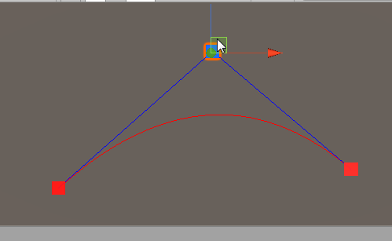

# Splines

Simple Quadratic/Cubic curve implementations in Unity.

The curves have their own data structure, allowing you to create at start, sample whenever you want and update point locations and point count.

# Contains

Quadratic Curve data structure;
Cubic Curve data structure.

Curves classes contain:

	Evaluate(float t)
	Draw()
	Update(p1, p2, pivot, [pivot2])
	UpdatePointCount(int count)
	Next()

Feel free to make pull requests and add more spline types!

# Consider buying me a coffee if you like my work (click the image)

